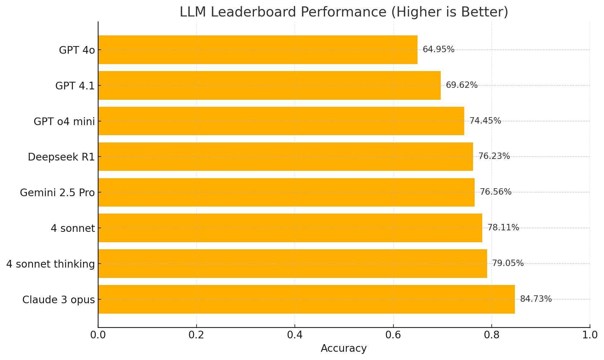
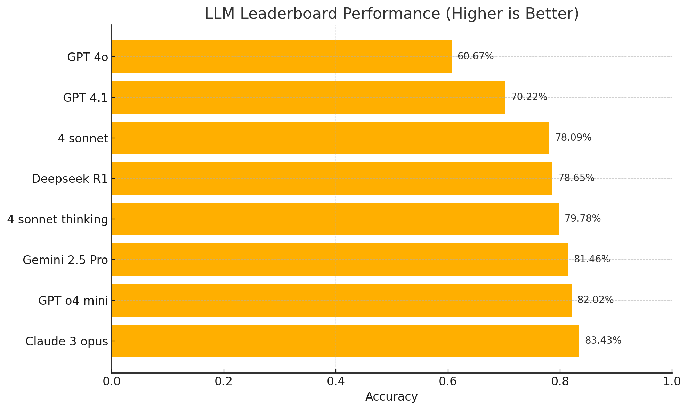
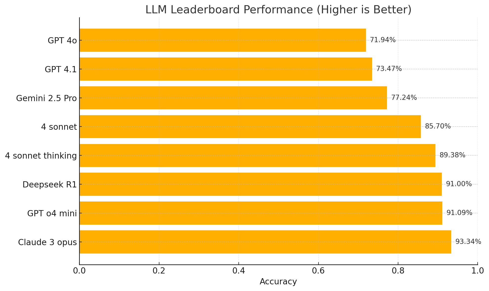
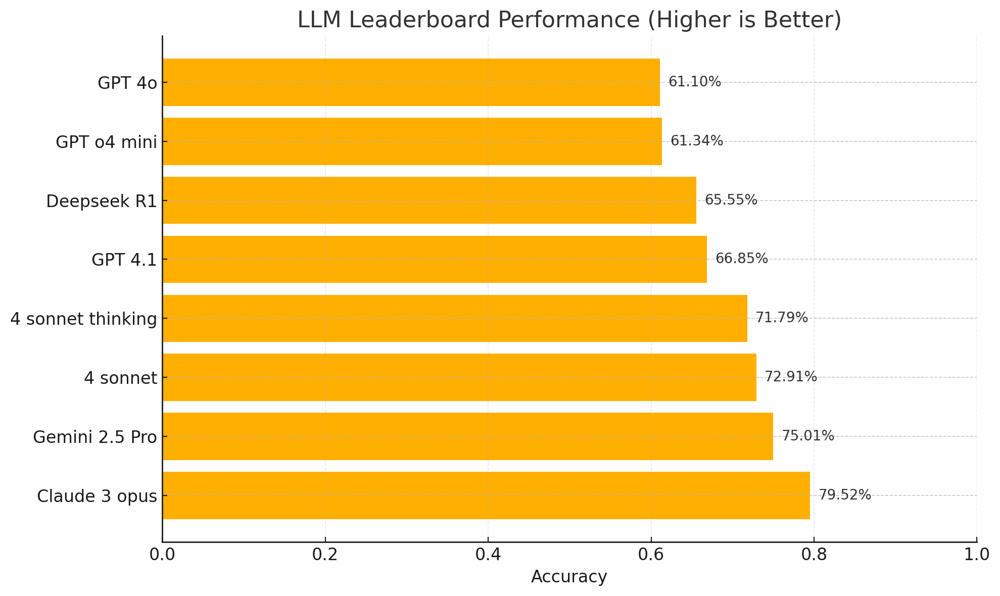

# AudiologyQA
# Audiology LLMs Dataset

A comprehensive collection of >3,000 audiology questions designed for assessment, examinations, LLM benchmarking, and AI research in audiology and related subjects.

## Overview

The dataset comprises questions automatically extracted and transformed from publicly accessible audiology textbooks and exam collections found online, then further processed and cleaned with the assistance of a large language model (LLM). It covers core and clinical topics in audiology, hearing science, and speech-language pathology, offering True/False (TF), Fill-in-the-Blank (FIB), and Multiple-Choice (MCQ) formats.

## Dataset Details

| **Property**           | **Value**                                                                                                                                  |
|------------------------|--------------------------------------------------------------------------------------------------------------------------------------------|
| **Domain**             | - Anatomy & Physiology: 1117 questions<br>- Audiology Professional Knowledge: 1948 questions<br>- Clinical Decision-Making: 431 questions<br>- Empathy & Communication: 66 questions<br>- Instrumentation: 227 questions<br>- Others: 55 questions |
| **Purpose**            | Educational assessment, examination, study tools, AI model training, LLM benchmarking                                                        |
| **Languages**          | English                                                                                                                                    |
| **Question Types**     | TF, FIB, MCQ                                                                                                                               |
| **Files**              | JSON Lines (`.jsonl`) files                                                                                                                |
| **Total Questions**    | 3775                                                                                                                                       |
| **Size**               | ≈ 2.3 MB                                                                                                                                   |

### Data Fields

| Field       | Type                          | Description                                                                                             |
|-------------|-------------------------------|---------------------------------------------------------------------------------------------------------|
| `type`      | `string`                      | `"TF"`, `"FIB"`, or `"MCQ"`                                                                              |
| `chapter`   | `integer`                     | Source-chapter number                                                                                    |
| `original`  | `string`                      | Excerpt that inspired the question                                                                       |
| `question`  | `string`                      | Student-facing question text                                                                             |
| `answer`    | `boolean` \| `string` \| `string[]` | Correct answer:<br>- **TF** → `true`/`false`<br>- **FIB** → `string` or list of strings<br>- **MCQ** → correct option label |
| `difficulty`| `string`                      | `"easy"`, `"medium"`, or `"hard"`                                                                        |
| `tags`      | `string[]`                    | Content tags (e.g., `"Anatomy & Physiology"`, `"Audiology Professional Knowledge"`, `"Clinical Decision-Making"`) |

## Example

```json
{
  "type": "FIB",
  "chapter": 2,
  "original": "The cochlea is the end organ for hearing within the inner ear.",
  "question": "The ______ is the end organ for hearing within the inner ear.",
  "answer": "cochlea",
  "difficulty": "easy",
  "tags": ["Anatomy & Physiology"]
}
```

## Dataset Statistics

**Distribution**: 1112 TF, 1617 FIB, 356 MCQ  
**Difficulty Split**: 66 % Easy, 28 % Medium, 6 % Hard  
**Topic Coverage**:  
  - Anatomy & Physiology  
  - Audiology Professional Knowledge  
  - Clinical Decision-Making  
  - Empathy & Communication  
  - Instrumentation  
  - Other audiology-related topics  

Source Material
Content originates from publicly accessible textbooks and exam banks; wording may follow those sources closely.
Difficulty Labels
Assigned heuristically with LLM assistance; treat as guidance, not ground truth.
Coverage Bias
Topics mirror emphasis of the source texts, so some sub-fields may be under-represented.

## Preliminary LLM Evaluation Results

Preliminary LLM Evaluation Results

Overall (≈ 3000 questions)
| Model             | Total Correct | Total Questions | Accuracy |
| ----------------- | ------------: | --------------: | -------: |
| Claude 3 Opus     |          2614 |            3085 |   0.8473 |
| 4 Sonnet          |          2410 |            3085 |   0.7811 |
| 4 Sonnet Thinking |          2439 |            3085 |   0.7905 |
| GPT o4 Mini       |          2297 |            3085 |   0.7445 |
| GPT 4.1           |          2148 |            3085 |   0.6962 |
| GPT 4o            |          1659 |            3085 |   0.6796 |
| Gemini 2.5 Pro    |          2362 |            3085 |   0.7656 |
| Deepseek R1       |          2352 |            3085 |   0.7623 |



MCQ
| Model             | Total Correct | Total Questions | Accuracy |
| ----------------- | ------------: | --------------: | -------: |
| Claude 3 Opus     |           290 |             356 |   0.8343 |
| 4 Sonnet          |           278 |             356 |   0.7809 |
| 4 Sonnet Thinking |           284 |             356 |   0.7978 |
| GPT o4 Mini       |           292 |             356 |   0.8202 |
| GPT 4.1           |           250 |             356 |   0.7022 |
| GPT 4o            |           216 |             356 |   0.6067 |
| Gemini 2.5 Pro    |           290 |             356 |   0.8146 |
| Deepseek R1       |           280 |             356 |   0.7865 |



TF
| Model             | Total Correct | Total Questions | Accuracy |
| ----------------- | ------------: | --------------: | -------: |
| Claude 3 Opus     |          1038 |            1112 |   0.9334 |
| 4 Sonnet          |           953 |            1112 |   0.8570 |
| 4 Sonnet Thinking |           994 |            1112 |   0.8938 |
| GPT o4 Mini       |          1013 |            1112 |   0.9109 |
| GPT 4.1           |           817 |            1112 |   0.7347 |
| GPT 4o            |           800 |            1112 |   0.7194 |
| Gemini 2.5 Pro    |           859 |            1112 |   0.7724 |
| Deepseek R1       |          1012 |            1112 |   0.9100 |



FIB
| Model             | Total Correct | Total Questions | Accuracy |
| ----------------- | ------------: | --------------: | -------: |
| Claude 3 Opus     |          1286 |            1617 |   0.7952 |
| 4 Sonnet          |          1179 |            1617 |   0.7291 |
| 4 Sonnet Thinking |          1161 |            1617 |   0.7179 |
| GPT o4 Mini       |           992 |            1617 |   0.6134 |
| GPT 4.1           |          1081 |            1617 |   0.6685 |
| GPT 4o            |           988 |            1617 |   0.6110 |
| Gemini 2.5 Pro    |          1213 |            1617 |   0.7501 |
| Deepseek R1       |          1060 |            1617 |   0.6555 |



## Prompts for Generation and Answering

## MCQ Prompt
You are taking an audiology multiple-choice exam.

For each question:
– Write only the letter (A, B, C, or D) on its own line, prefixed by the question number.
– No explanations.
– Finish all questions.

Example:
1. C
2. A
…

## TF/FIB Prompt
You are an expert audiologist.

Task
You will receive a series of JSON objects, one per line, each containing:
  • "type": either "TF" (true/false) or "FIB" (fill-in-the-blank)
  • "question": the text the model must answer

Output format
Return **one line per input, in the same order**, following these rules:

1. Begin each line with the 1-based index of the question, followed by a period and a single space.  
   Example: `1. `
2. For "TF" questions, write only `True` or `False`.
3. For "FIB" questions, write only the missing word or phrase(s), exactly as they should appear in the blank.  
   • If the prompt implies multiple blanks, separate the answers with a comma and a single space (e.g., `auditory, speechreading training`).
4. Do **not** repeat, quote, or rephrase the question or provide any explanation.
5. Do **not** output anything before the first answer line or after the last answer line.

## Answer Check Prompt
You are an expert audiology educator.

Task
Grade each item by comparing the current answers with Correct Answers in the same folder.
Treat an answer as **correct** if ANY of the following is true:

  1. After lower-casing and stripping leading/trailing spaces and punctuation, the strings match exactly.
  2. The model_answer contains the entire correct phrase verbatim, even if extra words appear before or after.
  3. The only difference is a parenthetical acronym/abbreviation, e.g.,
         correct: “Transfer-Appropriate Processing”
         model:   “Transfer-Appropriate Processing (TAP)”
  4. The model_answer adds or drops a generic filler noun such as test, technique, technology, training, assessment, procedure, approach, method  
     (e.g., “probe microphone technology” ≅ “probe microphone”).
  5. In your expert judgment the terms are true synonyms in standard audiology usage.

Output format
One line per item in original order, followed by a summary line:

<index>. <✅ or ❌>  (<type>)  
           • If ❌, append “ – expected: <correct>, got: <model_answer>”

After the last item, output:  
Score: <correct_count>/<total> (Accuracy = <rounded %>%)

Strict rules
- Use exactly “✅” for correct and “❌” for incorrect.
- Do **not** repeat the questions or add explanations beyond what is specified.
- Accuracy is a whole-number percentage rounded to the nearest integer.

## License

All original content in this work is licensed under the Creative Commons Attribution-NonCommercial 4.0 International License (CC BY-NC 4.0).

Permissions
Share — copy and redistribute the material in any medium or format.
Adapt — remix, transform, and build upon the material.
Terms
Attribution: You must give appropriate credit to the original author(s), provide a link to the license, and indicate if changes were made.
NonCommercial: You may not use the material for commercial purposes.
No additional restrictions: You may not apply legal terms or technological measures that legally restrict others from doing anything the license permits.
Third-Party and Public-Domain Material
Public-domain content remains in the public domain and is not subject to copyright.
Openly posted educational materials with their own license or terms still require compliance with those terms.
Third-party copyrighted excerpts used under permission or fair use remain subject to their original terms.
Non-Commercial Use Encouraged

This work may be used, shared, and adapted for non-commercial educational or research purposes provided attribution is given. For commercial use or large-scale redistribution, you must obtain permission from the respective rights holders.

## Citation

If this dataset assists your work, please cite:

```bibtex
@dataset{audiology_question_dataset_2025,
  title     = {Audiology examination LLMs Dataset},
  author    = {Changgeng Mo, Haoshuai Zhou, Boxuan Cao, Linkai Li},
  year      = {2025},
  publisher = {GitHub},
  note      = {Audiology question bank with difficulty annotations},
  url       = {https://github.com/pc9413/AudiologyQA}
}
```

## Contributing

Pull requests for corrections, additional questions, or metadata improvements are welcome. Open an issue for discussion before large contributions.

This dataset supports the global audiology education community — helping students, educators, and researchers explore the science of hearing.
